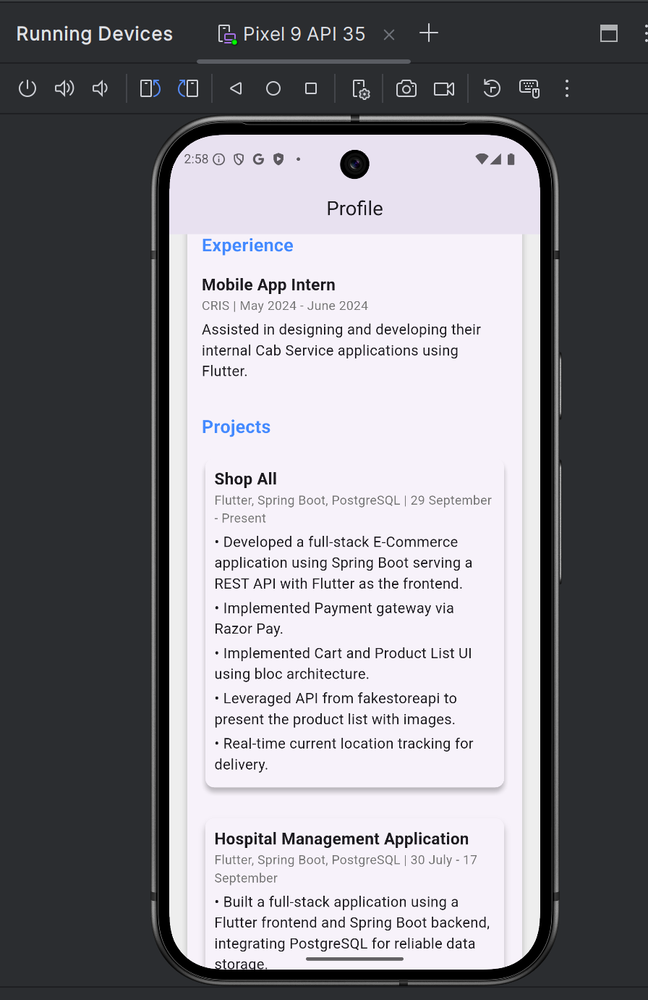

# 📱 My Profile – A Flutter Portfolio App  

  

A **beautiful and responsive** portfolio application built with **Flutter**, showcasing personal projects, skills, and experience.  

## 🚀 Features  

✅ **Modern UI** – A clean and interactive design to showcase your profile.  
✅ **Responsive Layout** – Works smoothly across mobile, tablet, and web.  
✅ **Projects Showcase** – Displays past work with images and descriptions.  
✅ **Social Media Integration** – Links to GitHub, LinkedIn, and other platforms.  
✅ **Smooth Animations** – Uses Flutter's built-in animations for a polished user experience.  

(image3.png)

## 🛠️ Tech Stack  

- **Flutter** – Frontend framework  
- **Dart** – Programming language  
- **Provider** – State management (if used)  
- **Firebase** – Backend (if applicable)  
- **GitHub Actions** – CI/CD (if applicable)  

## 📥 Installation  

1️⃣ Clone this repository:  
```sh
git clone https://github.com/yourusername/my_profile.git
cd my_profile
